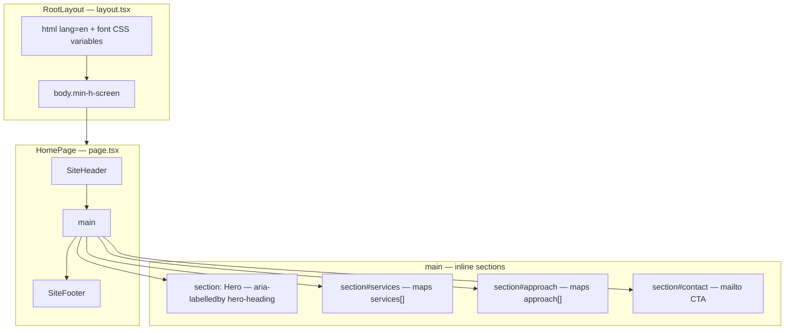
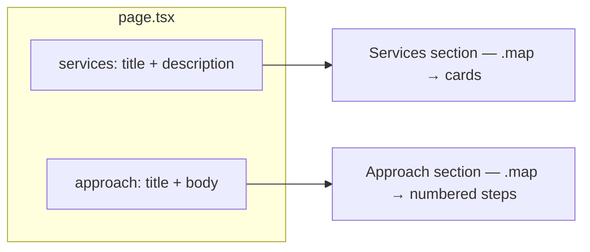
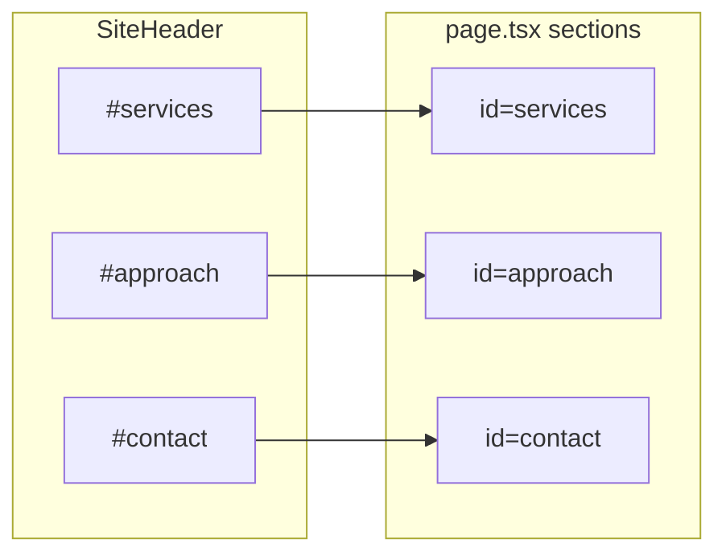
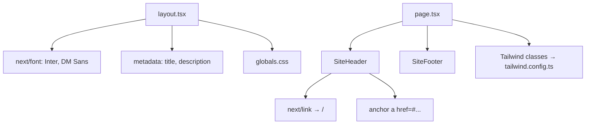

# Santa Services LLC — Website

Next.js (React) + TypeScript + Tailwind CSS. Professional consulting / services landing page.

## Prerequisites

- [Node.js](https://nodejs.org/) LTS (includes npm)

## Quick start

```bash
cd c:\SourceCode\santaservicesllc
npm install
npm run dev
```

Open [http://localhost:3000](http://localhost:3000).

- **Production build:** `npm run build` then `npm start`
- **Lint:** `npm run lint`

---

## Files and responsibilities

| File | Role |
|------|------|
| `src/app/layout.tsx` | Root layout: loads **Inter** + **DM Sans** (`next/font/google`), sets HTML `lang`, wraps all pages in `<body>`, exports **SEO metadata** (`title`, `description`). Imports global CSS. |
| `src/app/globals.css` | Tailwind layers + base CSS variables (`--background`, `--foreground`), smooth scroll. |
| `src/app/page.tsx` | **Home route** (`/`): defines `services` and `approach` arrays, renders `SiteHeader`, four **inline sections** (hero, services, approach, contact), then `SiteFooter`. |
| `src/components/site-header.tsx` | Sticky header: logo (`next/link` → `/`), **anchor nav** (`#services`, `#approach`, `#contact`), primary CTA to `#contact`. |
| `src/components/site-footer.tsx` | Footer: company name, placeholder blurb, **dynamic year** via `new Date().getFullYear()`. |
| `tailwind.config.ts` | Theme extensions: `brand` / `ink` colors, `font-sans` / `font-display` tied to CSS variables from layout. |

There is **no client-side state** (`useState` / context) on the home page: content is **static JSX** plus **hash navigation**.

---

## Component hierarchy (React tree)



---

## Request and render flow (Next.js App Router)

```mermaid
sequenceDiagram
  participant Browser
  participant Next as Next.js server
  participant RL as RootLayout
  participant HP as page.tsx HomePage

  Browser->>Next: GET /
  Next->>RL: Render layout shell
  RL->>HP: Render children for route /
  HP->>HP: Build services + approach in memory
  HP->>HP: Render SiteHeader, sections, SiteFooter
  Next-->>Browser: HTML + CSS + font preload
  Note over Browser: Nav clicks use hash anchors; no full page load
```

---

## Data flow (home page)

`services` and `approach` live **only in `page.tsx`**. They are plain arrays; the page **maps** them into `<li>` grids. Nothing is fetched from an API and nothing is shared across routes yet.



---

## User navigation flow (anchors)

The header uses **same-page anchors**. Clicking **Services**, **Approach**, **Contact**, or **Get in touch** scrolls to the matching `id` (`#services`, `#approach`, `#contact`). `globals.css` sets `scroll-behavior: smooth` on `html`.



---

## Dependencies between pieces



---

## Customization checklist

- Contact email lives in **`src/config/site.ts`** (`CONTACT_EMAIL`, currently **srimaniv@santaservicesllc.com**). Update there to change it site-wide (or wire a contact form).
- Update **footer** copy in `src/components/site-footer.tsx` (address, disclosures).
- Edit **`services`** and **`approach`** arrays in `src/app/page.tsx` for your offerings and methodology.
- Adjust **metadata** in `src/app/layout.tsx` for SEO title and description.
